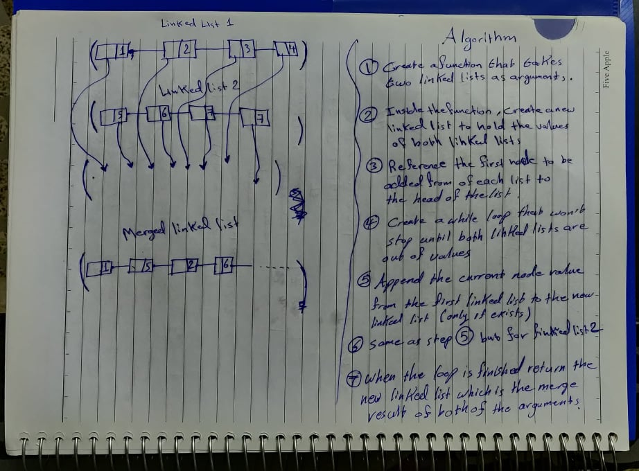

Pull Request: https://github.com/401-advanced-javascript-tommalieh/data-structures-and-algorithms/pull/10

# Linked List Merge Function
Create a function that takes two linked lists as arguments and returns a new linked list that contains the result of merging both of them.

## Challenge
- Appending the right value of the right linked list to the new linked list.
- Differnt sized linked lists.
## Approach & Efficiency

1- First of all we start by creating a function that takes two linked lists as arguments;

2- Inside the function we create a new linked list that will hold the merged linked lists.

3- Reference the first node of each list to be the head of it's linked list.

4- Create a while loop that stops when both linked lists are out of value.

5- Append the node value from the first linked list to the new linked lists (only if it exists).

6- Append the node value from the second linked list to the new linked lists (only if it exists).

7- When the loop is finished return the new linked list which is the merge result of both of the function arguments.

## Whiteboarding 

