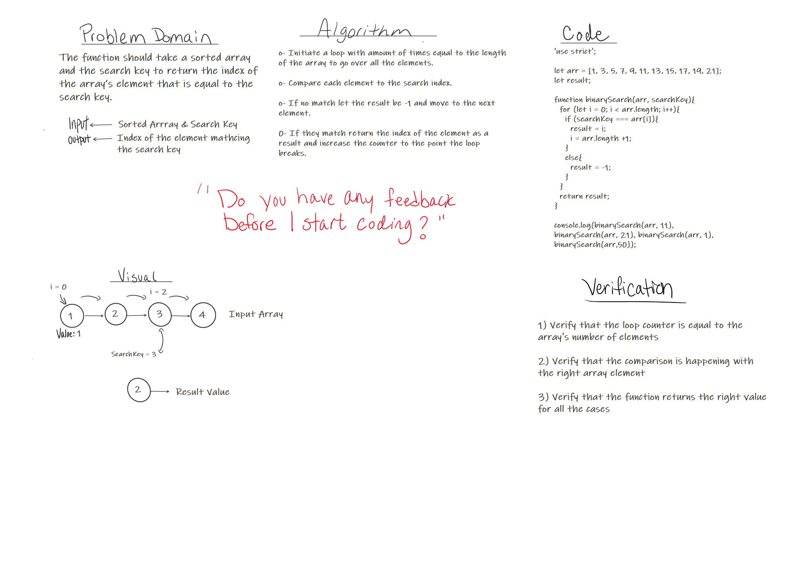

# Pull Request URL
Pull Request: https://github.com/401-advanced-javascript-tommalieh/data-structures-and-algorithms/pull/3

# Array Binary Search
The function should take a sorted array and the search key to return the index of the array’s element that is equal to the search key.

## Challenge
Accessing the array element and check if the element is equal to search index, if yes break the loop and return the index, other wise return -1

## Approach & Efficiency
1- Initiate a loop with amount of times equal to the length of the array to go over all the elements.

2- Compare each element to the search index.

3- If no match let the result be -1 and move to the next element.

4- If they match return the index of the element as a result and increase the counter to the point the loop breaks.

## Solution

