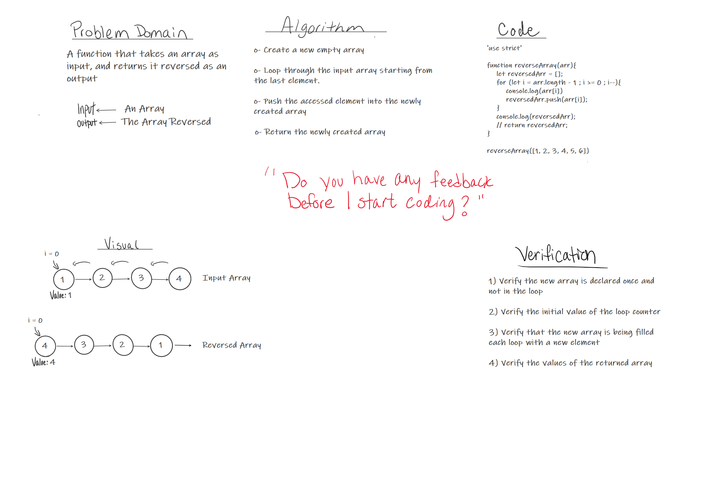

Pull Request: https://github.com/401-advanced-javascript-tommalieh/data-structures-and-algorithms/pull/2

# Insert Shift Array
The function should take an array and an element as inputs and return the array with the element added in the middle.

## Challenge
How to free and access the middle index of the array so we can add the element.

## Approach & Efficiency

1- In order to access the middle element i need it's index.

2- To get the middle index we devide the array length by 2.

3- Divide the array into two array seperated at that index.

4- Add the element to the end of the first array.

5- Combine the two array togother.

## Solution

<!--  -->