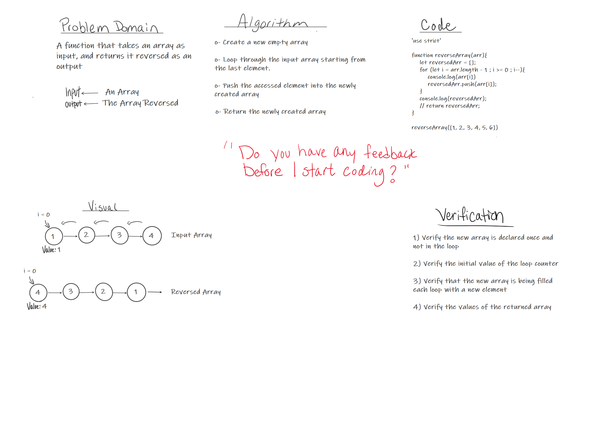

# Reverse an Array
The function should take an array as input and return it reversed as an output

## Challenge
How to access the array elements starting from the last till we reach the first one

## Approach & Efficiency
1- In order to access the last element i need it's index

2- To move through the array backwards i need to reduce this index by one each time.

3- Put the accesse element in a new array as a new element

## Solution

