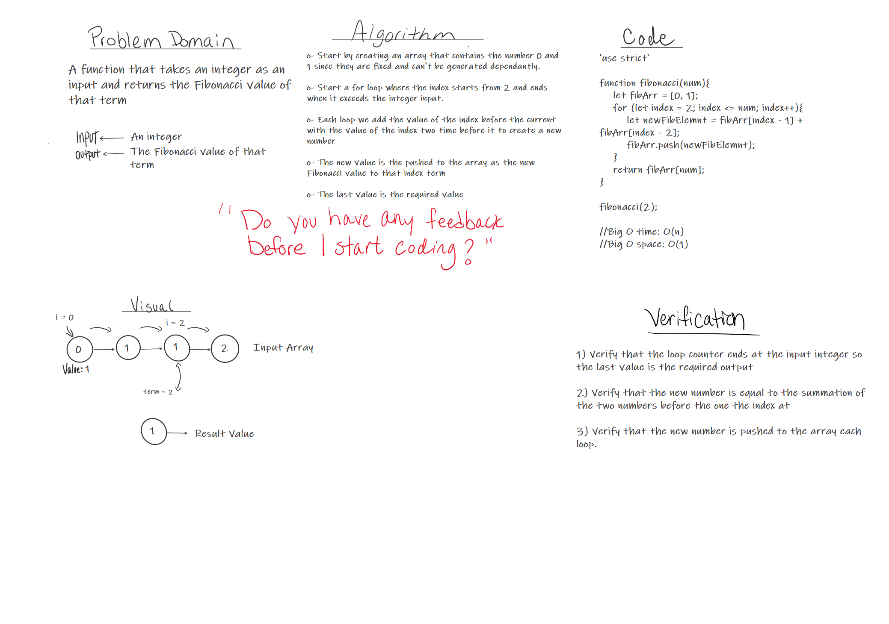

# Pull Request URL
Pull Request: https://github.com/401-advanced-javascript-tommalieh/data-structures-and-algorithms/pull/4

# Fibonacci Sequence
The function should take an integer and returns the equivalent Fibonacci value of such term.

## Challenge
Building the Fibonacci sequence depending on the integer

## Approach & Efficiency
1- Start by creating an array that contains the numbers 0 and 1 since they can't be generated dependantly.

2- Initiate a loop where the index starts from 2 and ends when it exceeds the integer input

3- Each loop we add the value of the index before the current index with the value of the index two times before it to create the new number in the sequence.

4- The new value is then pushed to the sequence array as the new Fibonacci value related to the index as a term.

5- The last value in the array is the required value

## Solution

