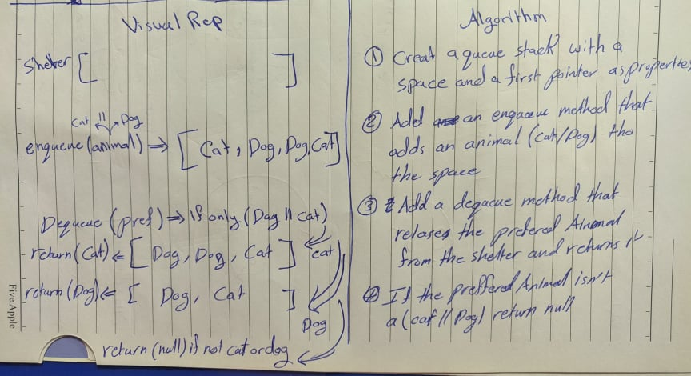

# Pull Request URL
Pull Request: https://github.com/401-advanced-javascript-tommalieh/data-structures-and-algorithms/pull/15

# Animal Shelter
Create a class called AnimalShelter which holds only dogs and cats. The shelter operates using a first-in, first-out approach.

## Challenge
Animals can only be dogs and cats also first in first out approach

## Approach & Efficiency
1- Creat a queue stack with a space array and a first pointer as properties.

2- Add and enqueue method that adds and animal (cat/dog) to the space

3- Add a dequeue method that releases a prefered animal from the space and returns it.

4- If the prefered animal is not a (cat/dog) return null
## Solution

