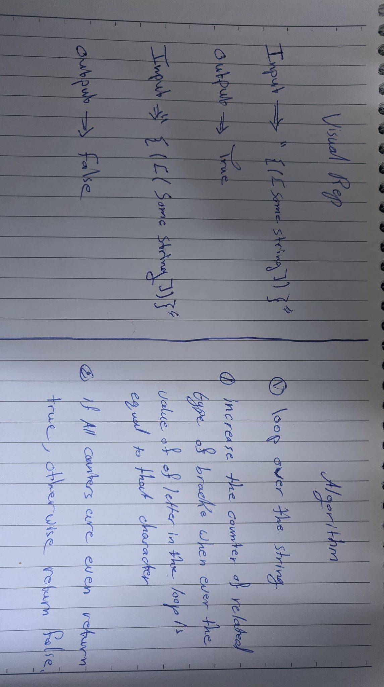

# Pull Request URL
Pull Request: https://github.com/401-advanced-javascript-tommalieh/data-structures-and-algorithms/pull/13

# Fibonacci Sequence
The function should take a string input and returns true if all brackets are closed correctly and false otherwise.

## Challenge
Including all types of brackets

## Approach & Efficiency
1- Create a loop that loops over the charecters of the string 

2- If the charecter during that loop was one of the brackets increase the counter of the related bracket.

3- If all the brackets counters are even then return true otherwise return false

## Solution

