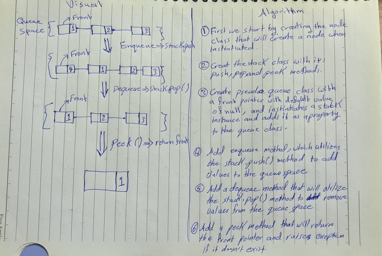

Pull Request: https://github.com/401-advanced-javascript-tommalieh/data-structures-and-algorithms/pull/12

# Queue with Stacks
Create a PseudoQueue class that will implement the standard queue interface, but will internally utilize 2 Stack objects.

## Challenge
Implementing the stack class inside the queue class.

## Approach & Efficiency

1- First of all we start by creating the node class that will create a new node when invoked.

2- Create the stack class with a top pointing to null as a defaul value.

3- Add an push() method to the stack class that will create a new node and add it to the bottom(beginning) of the stack.

4- Add the pop() method that will take no value and it will remove the first node added to the stack space.

5- Add peek() method that will show the front value in the queue.

6- Create the pseudo queue class with a front pointing to null as a defaul value and instintiates a stack instaces and adds it as a property to the queue class.

8- Add an enqueue() method that will utilize the stack push method to add values to queue space.

9- Add a dequeue() method that will utilize the stack pop method to remove values from the queue space.

10- Add a peek() method that will return the front pointer value if exists and rises an exeption if not.

## API

1. `enqueue()` - Utilize the stack push method to add values to queue space

2. `dequeque()` - Utilize the stack pop method to remove values from the queue space.

3. `peek()` - Return the front pointer value if exists and rises an exeption if not.

## Solution

