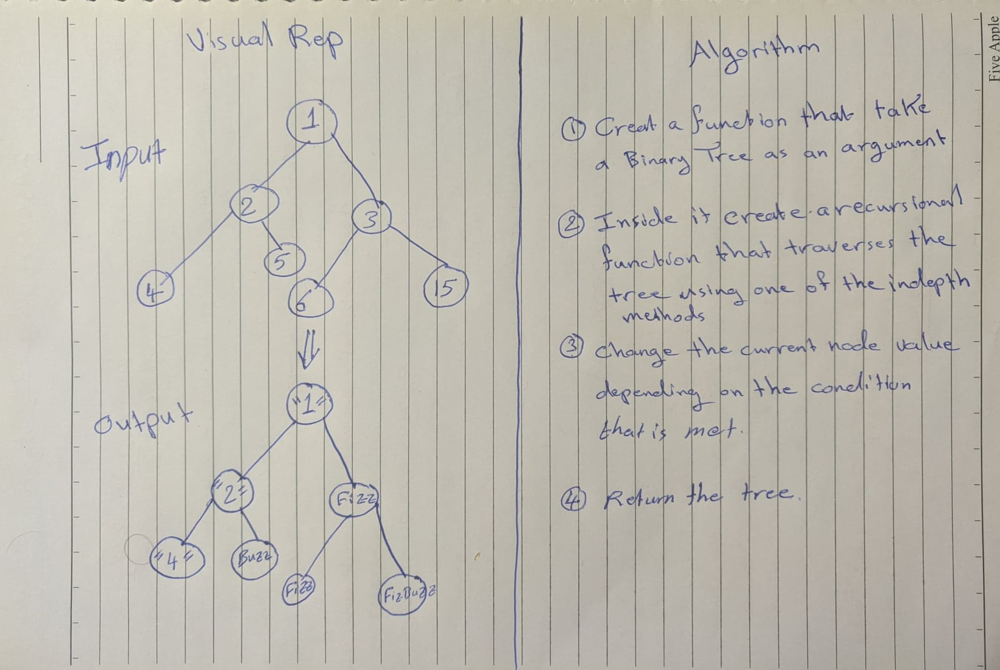

# Pull Request URL
Pull Request: https://github.com/401-advanced-javascript-tommalieh/data-structures-and-algorithms/pull/16

# Fizz-Buzz Tree
* Write a function called FizzBuzzTree which takes a tree as an argument. Determine whether or not the value of each node is divisible by 3, 5 or both. * * Create a new tree with the same structure as the original, but the values modified as follows:
  * If the value is divisible by 3, replace the value with “Fizz”.
  * If the value is divisible by 5, replace the value with “Buzz”.
  * If the value is divisible by 3 and 5, replace the value with “FizzBuzz”.
  * If the value is not divisible by 3 or 5, simply turn the number into a String.

## Challenge
Traverse through the tree nodes in the right order depending and comparing the right values with each other to determine the new value.

## Approach & Efficiency
1- Create a function that takes a Binary Tree as an argument.

2- Create a recursional function inside the main function that will traverse the tree using one of the Depth-First methods.

3- Change the current node value depending on the condition that has been met.

4- Return the Tree with the nodes having new values

* Big O(n)

## Solution
