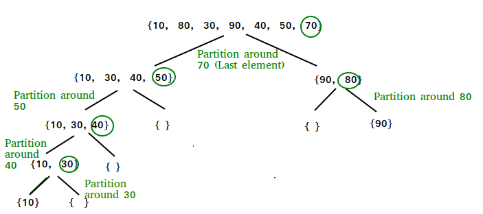

## Step 1
In the first pass of the quick sort, if the low index is less than the high index we assign the pivot pointer to the first value in the array, we also assign pointers i and j to low and high respectevly, then we loop through the array from i to i till we find a value greater than the pivot, then we also loop from j to i till we find a value less than the pivot. if i is less than j swap these two values else swap the pivot element with the arr element of j, return j and call the quickSort function for low and j as parameters, also call it with j+1 and h as parameter, these two calls represent the quick sort of the left elements and right elements of the array
## Step 2
The second pass through the array, the same thing happens but this time the array will consist of the elements to the left of the j value element, and it will loop through it and swap as before and then call the fucntion twice again.

## Step 3
Once all the left elements are sorted the execution of the calls for the right elements will happen, which will redo the same process but for those elements.

## Step 4
Once all calls are done the array will be returned sorted

### Efficency
 * Time: O(n^2)
    The basic operation of this algorithm is comparison. This will happen n * (n-1) number of times…concluding the algorithm to be n squared.
* Space: O(n)
    No additional space is being created. But a stack will be created have a space of (n)

