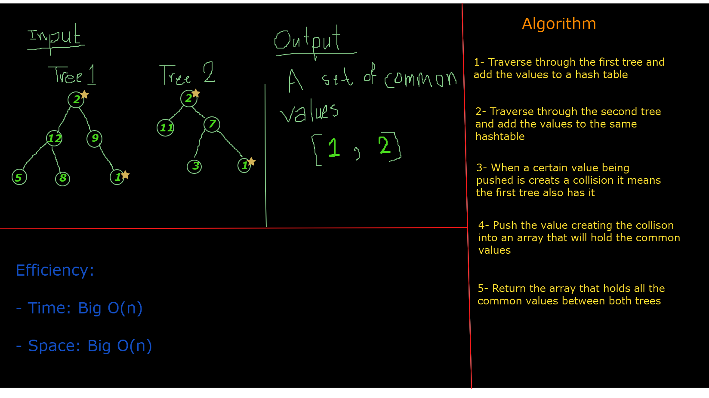

# Tree-Intersection
* tree_intersection that takes two binary tree parameters, returns a set of values found in both trees.

## Challenge
* Being able to allocate common values between two trees

## Approach & Efficiency

* Time: Big O(n)

* Space: Big O(n)

## Solution
