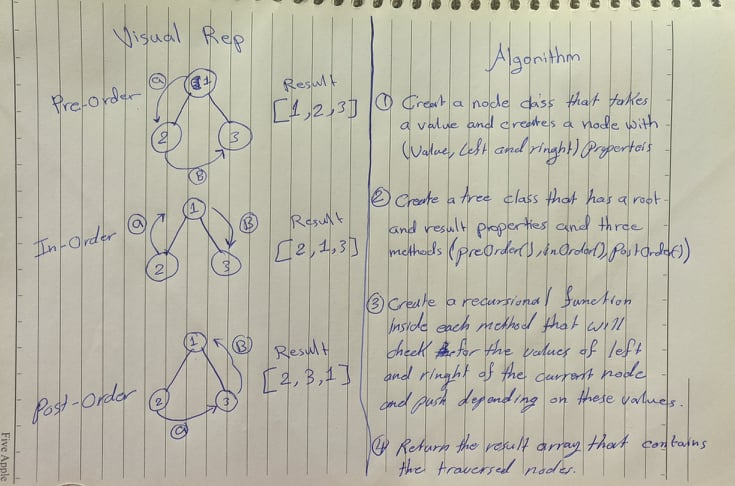

# Pull Request URL
Pull Request: https://github.com/401-advanced-javascript-tommalieh/data-structures-and-algorithms/pull/15

# Animal Shelter
Create a class called BinaryTree than can traverse a binary tree using the three depth first methods.

## Challenge
Traverse through the tree nodes in the right order depending on the type of traversal

## Approach & Efficiency
1- Creat a node class that takes a value and creates a node with value, left and right properties

2- Create a tree class that has a root and result properties and three methods(preorder(), inOrder(), postorder()).

3- Create a recursional function iside each method that will check for the values of left and right of the current node and traverse and push depending on these values.

4- Return the result array that contains the traversed nodes.

* Big O(n)

## Solution
