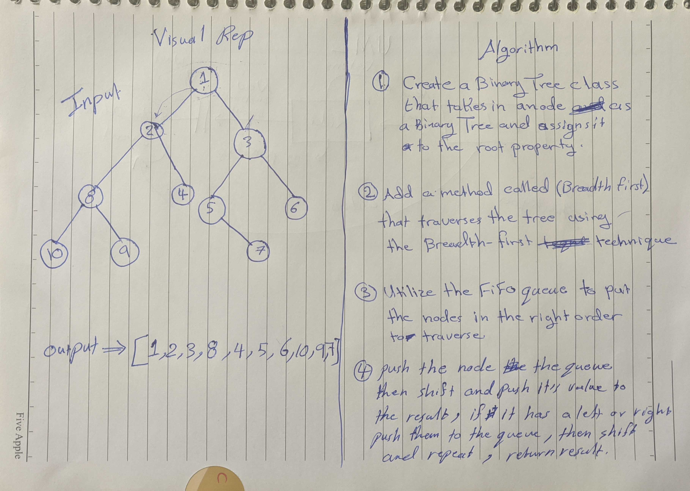

# Pull Request URL
Pull Request: https://github.com/401-advanced-javascript-tommalieh/data-structures-and-algorithms/pull/17

# Binary Trees Breadth First Traversal
Create a class called BinaryTree than can traverse a binary tree using the three depth first methods and breadth first method

## Challenge
Traverse through the tree nodes using the breadth first order where you go through the tree level by level

## Approach & Efficiency
1- Add a breadthFirst method to the binary tree class that will traverse the tree level by level starting from the root.

2- Utilize the FIFO queue inside the method by creating an empty array called queue.

3- Create an empty array called result to push the traversed values into.

4- First time we'll push the root to the queue array, and then check while the queue is not empty shift the first value and store it in a variable called node.

4- If this node has a left or right values push them to the queue, push the node value to the results array.

5- Next iteration the new node ill be the previous node.left if exists and the same process as point 4 will happen.

6- When we reach the bottom of the tree the queue will be empty and the while loop will break, return the result array.

* Big O(n)

## Solution
